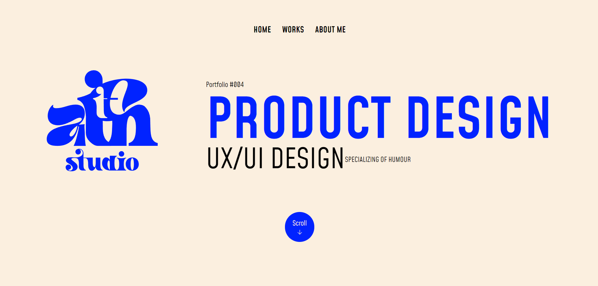

<div align="center">
  
</div>
<h1 align="center">
  ATTH Studio
</h1>



## 🛠 Installation & Set Up

1. Install dependencies

```sh
npm install
```

or

```sh
yarn install
```

2. Start the development server

```sh
npm run dev
```
or 

```sh
yarn dev
```
