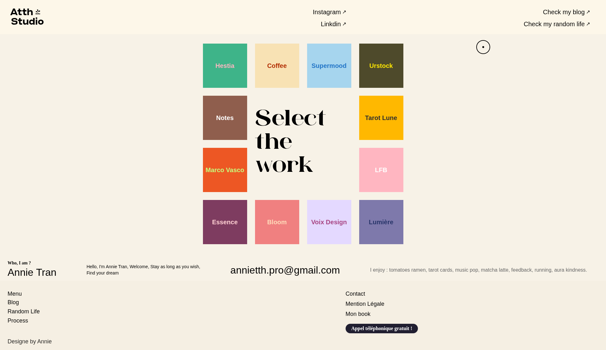

<div align="center">
  
</div>
<h1 align="center">
  ATTH Studio
</h1>
<p>Design : <a href="https://www.behance.net/annietran8">Annie Tran</a></p>
<p>Development : <a href="https://github.com/Renaudfradin">Renaud Fradin</a></p>



## 🛠 Installation & Set Up

1. Install dependencies

```sh
npm install
```

or

```sh
yarn install
```

2. Start the development server

```sh
npm run dev
```

or

```sh
yarn dev
```

3. Format code

```sh
npm run format
```
